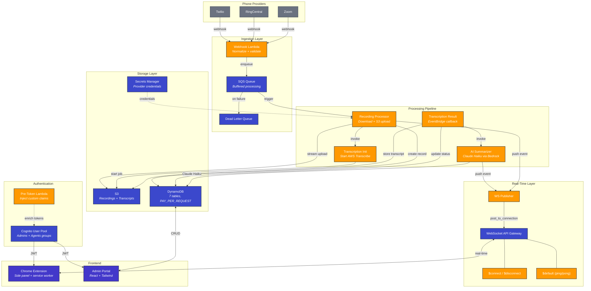

<p align="center">
  <picture>
    <source media="(prefers-color-scheme: dark)" srcset="https://img.shields.io/badge/SOTTO-AI%20Call%20Intelligence-6366f1?style=for-the-badge&labelColor=1e1b4b&logo=data:image/svg+xml;base64,PHN2ZyB4bWxucz0iaHR0cDovL3d3dy53My5vcmcvMjAwMC9zdmciIHdpZHRoPSIyNCIgaGVpZ2h0PSIyNCIgdmlld0JveD0iMCAwIDI0IDI0IiBmaWxsPSJub25lIiBzdHJva2U9IndoaXRlIiBzdHJva2Utd2lkdGg9IjIiPjxwYXRoIGQ9Ik0yMiAxNi45MnYzYTIgMiAwIDAgMS0yLjE4IDIgMTkuNzkgMTkuNzkgMCAwIDEtOC42My0zLjA3IDE5LjUgMTkuNSAwIDAgMS02LTYgMTkuNzkgMTkuNzkgMCAwIDEtMy4wNy04LjY3QTIgMiAwIDAgMSA0LjExIDJoM2EyIDIgMCAwIDEgMiAxLjcyYy4xMjcuOTYuMzYyIDEuOTAzLjcgMi44MWEyIDIgMCAwIDEtLjQ1IDIuMTFMOC4wOSA5LjkxYTE2IDE2IDAgMCAwIDYgNmwxLjI3LTEuMjdhMiAyIDAgMCAxIDIuMTEtLjQ1Yy45MDcuMzM4IDEuODUuNTczIDIuODEuN0EyIDIgMCAwIDEgMjIgMTYuOTJ6Ii8+PC9zdmc+">
    
  </picture>
</p>

<p align="center">
  <strong>Record every call. Transcribe in real time. Surface AI-powered notes — right where your agents work.</strong>
</p>

<p align="center">
  
  
  
  
  
</p>

---

**Sotto** is an AI call intelligence platform built for insurance agencies. It plugs into any phone system (Twilio, RingCentral, Zoom, Teams, 8x8), automatically records and transcribes calls, then generates structured AI summaries with action items — all surfaced in a Chrome side panel that sits beside the agent's CRM.

Multi-tenant from day one. Serverless. Zero infrastructure to manage.

---

## How It Works

```
Agent takes a call
     |
     v
Phone provider sends webhook ──> Lambda queues event to SQS (responds in <3s)
     |
     v
Recording Processor downloads audio ──> streams to S3 via multipart upload
     |
     v
Transcription Init kicks off AWS Transcribe with speaker diarization
     |
     v
Transcription Result receives callback ──> stores transcript in S3
     |
     v
AI Summarizer (Claude Haiku via Bedrock) generates notes + action items
     |
     v
WebSocket push ──> Chrome extension updates in real time
```

The agent sees the transcript, summary, and action items appear in their browser sidebar — no tab switching, no manual note-taking.

---

## Architecture



---

## Tech Stack

| Layer | Technology |
|---|---|
| **Runtime** | Python 3.13 on arm64 (Graviton2) |
| **IaC** | AWS SAM (CloudFormation) |
| **Compute** | AWS Lambda (all functions) |
| **API** | HTTP API Gateway (REST) + WebSocket API Gateway (real-time) |
| **Auth** | Amazon Cognito (SRP auth, JWT, user groups) |
| **Database** | DynamoDB (7 tables, PAY_PER_REQUEST, PITR in prod) |
| **Storage** | S3 (recordings + transcripts, multipart streaming upload) |
| **Transcription** | AWS Transcribe (speaker diarization, 2-speaker) |
| **AI** | Amazon Bedrock — Claude Haiku (`claude-haiku-4-5-20251001`) |
| **Secrets** | AWS Secrets Manager (provider API keys) |
| **Queue** | SQS (call events with DLQ, 3 retries) |
| **Observability** | AWS Powertools (structured logging, X-Ray tracing, CloudWatch metrics) |
| **Extension** | Chrome Manifest V3 (side panel, service worker, WebSocket) |
| **Admin Portal** | React 18 + Vite + Tailwind CSS |
| **CI/CD** | GitHub Actions + SAM deploy (canary + linear rollout) |

---

## Project Structure

```
sotto/
├── backend/
│   ├── template.yaml                  # SAM infrastructure-as-code
│   ├── samconfig.toml                 # Deploy configuration
│   └── src/
│       ├── layers/common/sotto/       # Shared Python layer
│       │   ├── db.py                  #   DynamoDB operations
│       │   ├── s3.py                  #   S3 read/write helpers
│       │   ├── secrets.py             #   Secrets Manager client
│       │   ├── models.py              #   Pydantic event models
│       │   ├── feature_flags.py       #   Feature flag evaluation
│       │   ├── ws_publisher.py        #   WebSocket push utility
│       │   └── logger.py              #   Powertools (logger, tracer, metrics)
│       ├── handlers/
│       │   ├── webhooks/              # Provider webhook entry point
│       │   ├── calls/                 # Recording processor, transcription pipeline
│       │   ├── ai/                    # Bedrock summarizer
│       │   ├── websocket/             # $connect, $disconnect, $default
│       │   ├── agents/                # Agent API (call history, detail, notes)
│       │   ├── admin/                 # Admin API (tenants, agents, mappings)
│       │   └── internal/              # Health check
│       └── tests/                     # Unit + integration tests
├── frontend/
│   ├── extension/                     # Chrome Extension (Sotto side panel)
│   │   ├── manifest.json              #   MV3 manifest
│   │   └── src/
│   │       ├── background/            #   Service worker (WebSocket, keepalive)
│   │       ├── sidepanel/             #   UI (call list, detail, login)
│   │       ├── content/               #   Epic CRM injector
│   │       └── shared/                #   Auth + API client modules
│   └── admin-portal/                  # React admin dashboard
│       └── src/
│           ├── pages/                 #   Login, Dashboard, Agents, Calls, Settings
│           └── services/              #   API client
└── docs/
    ├── sotto-00-overview.md
    ├── sotto-01-infrastructure.md
    ├── sotto-02-backend.md
    ├── sotto-03-logging-cicd.md
    └── sotto-04-security-frontend.md
```

---

## Backend Components

### Lambda Functions

| Function | Trigger | Purpose |
|---|---|---|
| **ProviderWebhook** | HTTP API `POST /webhooks/{provider}` | Validates Twilio signature, normalizes event, enqueues to SQS. Returns `<Response/>` within 3s. |
| **RecordingProcessor** | SQS `sotto-call-events` | Downloads recording from provider, streams to S3 via multipart upload, creates call record, invokes transcription. |
| **TranscriptionInit** | Lambda invoke (async) | Starts AWS Transcribe job with speaker diarization. |
| **TranscriptionResult** | EventBridge rule | Receives Transcribe completion, stores transcript in S3, updates call status, invokes summarizer. |
| **AISummarizer** | Lambda invoke (async) | Sends transcript to Claude Haiku via Bedrock. Extracts summary + action items. Pushes `summary_ready` via WebSocket. |
| **WSConnect** | WebSocket `$connect` | Validates JWT, stores connection in DynamoDB with agent_id + TTL. |
| **WSDisconnect** | WebSocket `$disconnect` | Removes connection from DynamoDB. |
| **WSDefault** | WebSocket `$default` | Handles ping/pong keepalive (Chrome MV3 requires <30s incoming messages to keep service worker alive). |
| **CallHistory** | HTTP API `GET /calls` | Returns paginated call list for the authenticated agent's tenant. |
| **CallDetail** | HTTP API `GET /calls/{call_id}` | Returns full call record with parsed transcript from S3. Also serves `GET /calls/{call_id}/recording-url` (presigned S3 URL). |
| **Notes** | HTTP API `PUT /calls/{call_id}/notes` | Updates agent notes on a call record. |
| **AgentInvite** | HTTP API `POST /agents` | Creates agent in DynamoDB + Cognito, sends invite email. |
| **AgentConfirm** | HTTP API `POST /agents/{agent_id}/confirm` | Confirms agent signup, activates account. |
| **NumberMapping** | HTTP API `POST /number-mappings` | Maps phone numbers/SIP URIs to agent IDs for call routing. |
| **TenantConfig** | HTTP API `GET/PUT /tenant/config` | Manages tenant settings and provider configuration. |
| **Signup** | HTTP API `POST /signup` | Self-service tenant registration. |
| **PreToken** | Cognito trigger | Injects `custom:agent_id`, `custom:tenant_id`, and `custom:role` into JWT claims at login. |
| **RolloutManager** | Internal | Manages canary/linear deployment progression across tenants. |
| **HealthCheck** | HTTP API `GET /health` | Connectivity check for DynamoDB + S3. |

### Common Layer (`sotto/`)

| Module | Responsibility |
|---|---|
| `db.py` | All DynamoDB operations — calls, agents, tenants, number mappings, WebSocket connections, feature flags |
| `s3.py` | Recording upload (multipart streaming), transcript read/write |
| `secrets.py` | Secrets Manager client with caching — provider API credentials |
| `models.py` | Pydantic models for normalized call events |
| `feature_flags.py` | Feature flag evaluation with deployment tier support (`beta` / `live_test` / `full`) |
| `ws_publisher.py` | Finds agent's WebSocket connections and pushes events via API Gateway Management API |
| `logger.py` | Shared Powertools instances — `logger`, `tracer`, `metrics` (never re-instantiate in handlers) |

---

## Data Model

### DynamoDB Tables

| Table | PK | SK | Key GSIs |
|---|---|---|---|
| `sotto-calls` | `tenant_id` | `call_id` | `agent-date-index` (PK=`agent_date_key`, SK=`created_at`) · `status-index` (PK=`tenant_id`, SK=`status`) |
| `sotto-agents` | `tenant_id` | `agent_id` | `email-index` (PK=`email`) · `cognito-index` (PK=`cognito_sub`) |
| `sotto-tenants` | `tenant_id` | — | `status-index` (PK=`status`, SK=`created_at`) |
| `sotto-number-mappings` | `tenant_id` | `identifier` | — |
| `sotto-ws-connections` | `connection_id` | — | `agent-index` (PK=`agent_id`) · TTL on `ttl` attribute |
| `sotto-feature-flags` | `flag_name` | — | — |
| `sotto-deployments` | `deployment_id` | — | — |

### Call Lifecycle

```
recording ──> transcribing ──> summarizing ──> complete
                   |                |
                   v                v
                failed           failed
```

---

## Chrome Extension

The **Sotto** Chrome extension is a Manifest V3 side panel that provides real-time call intelligence directly in the browser — designed to sit beside Applied Epic or any CRM.

**Features:**
- **Live call feed** — new calls appear via WebSocket push as they're recorded
- **Call history** — scrollable list with status badges, relative timestamps, formatted phone numbers
- **Call detail** — tap any call for transcript (color-coded by speaker), AI summary, action items, and editable notes
- **Persistent WebSocket** — 20-second keepalive pings prevent Chrome from terminating the service worker
- **Cognito SRP auth** — secure login with automatic token refresh
- **Epic CRM integration** — content script detects client context from Applied Epic

**Architecture:**
- `service_worker.js` — manages WebSocket connection, token refresh, message routing
- `sidepanel.js` — three-view UI (login, call list, call detail) with live updates
- `auth.js` — token storage, JWT decode, Cognito REST refresh (works in service worker context)
- `api.js` — REST client for Agent API with automatic 401 retry

---

## Admin Portal

React + Vite + Tailwind dashboard for agency administrators.

| Page | Function |
|---|---|
| **Dashboard** | Overview of call volume, agent activity, system health |
| **Agents** | Invite agents, manage status (invited/active/inactive) |
| **Number Mappings** | Map phone numbers to agents for automatic call routing |
| **Call History** | Searchable call list with 5-second auto-refresh |
| **Call Detail** | Full transcript with speaker labels, audio player, MP3 download (presigned S3 URL), AI summary, editable notes |
| **Settings** | Tenant configuration, provider API setup |

---

## Deployment

### Prerequisites

- AWS CLI configured with appropriate credentials
- [AWS SAM CLI](https://docs.aws.amazon.com/serverless-application-model/latest/developerguide/install-sam-cli.html) installed
- Python 3.13
- Node.js 18+ (for admin portal)

### Deploy Backend

```bash
cd backend
sam build
sam deploy --guided    # first time — creates samconfig.toml
sam deploy             # subsequent deploys
```

### Deploy Admin Portal

```bash
cd frontend/admin-portal
npm install
npm run build
aws s3 sync dist/ s3://sotto-portal-{account_id}-{env}/ --delete
```

### Load Chrome Extension

1. Open `chrome://extensions`
2. Enable **Developer mode**
3. Click **Load unpacked** → select `frontend/extension`
4. Click the Sotto icon to open the side panel

### Deployment Strategy

Production deployments use a canary + linear rollout:

```
Deploy ──> Canary (10% traffic, 5 min) ──> Linear (10% every 5 min) ──> 100%
                    |                                    |
              Alarm? Rollback                     Alarm? Rollback
```

CloudWatch alarms monitor error rates and latency during rollout. Automatic rollback on threshold breach.

---

## Observability

Every Lambda function uses the full AWS Powertools stack:

```python
@logger.inject_lambda_context(log_event=True, correlation_id_path="requestContext.requestId")
@tracer.capture_lambda_handler(capture_response=True)
@metrics.log_metrics(capture_cold_start_metric=True)
def handler(event, context): ...
```

**Logging contract** (every function, no exceptions):
- Entry: function metadata, memory, remaining time
- Branch decisions: flag name, tier, result
- External calls: BEFORE/AFTER with duration_ms
- DynamoDB ops: table, key fields, operation
- WebSocket pushes: agent_id, connection_id, event_type
- Exit: duration_ms, result_status
- Exceptions: full context, then re-raise for SQS retry

**Never logged:** full phone numbers, recording URLs, JWTs, secrets.

---

## Security

- **Secrets** — provider API keys stored in AWS Secrets Manager (`sotto/{tenant_id}/{provider}_auth_token`), never in env vars or DynamoDB
- **Auth** — Cognito JWT with custom claims injected by pre-token trigger. HTTP API uses JWT authorizer. WebSocket validates token on `$connect`.
- **Tenant isolation** — every DynamoDB query is scoped by `tenant_id` from JWT claims. Cross-tenant access returns 403.
- **Webhook validation** — Twilio signature verification on every incoming webhook
- **Recording access** — S3 presigned URLs with 15-minute expiry and `Content-Disposition: attachment`
- **No stored state in extension** — tokens in `chrome.storage.session` (cleared on browser close), user info in `chrome.storage.local`

---

## Providers

Sotto uses a provider-agnostic adapter pattern. The webhook normalizes events into a common `NormalizedCallEvent` schema regardless of source.

| Provider | Status | Webhook Format |
|---|---|---|
| **Twilio** | Production | `application/x-www-form-urlencoded` with HMAC signature |
| **RingCentral** | Adapter ready | JSON webhook with verification token |
| **Zoom** | Adapter ready | JSON webhook with verification token |
| **Microsoft Teams** | Adapter ready | Graph API subscription |
| **8x8** | Adapter ready | JSON webhook |

---

<p align="center">
  <sub>Built with AWS SAM, Claude Haiku, and a lot of late nights.</sub>
</p>
